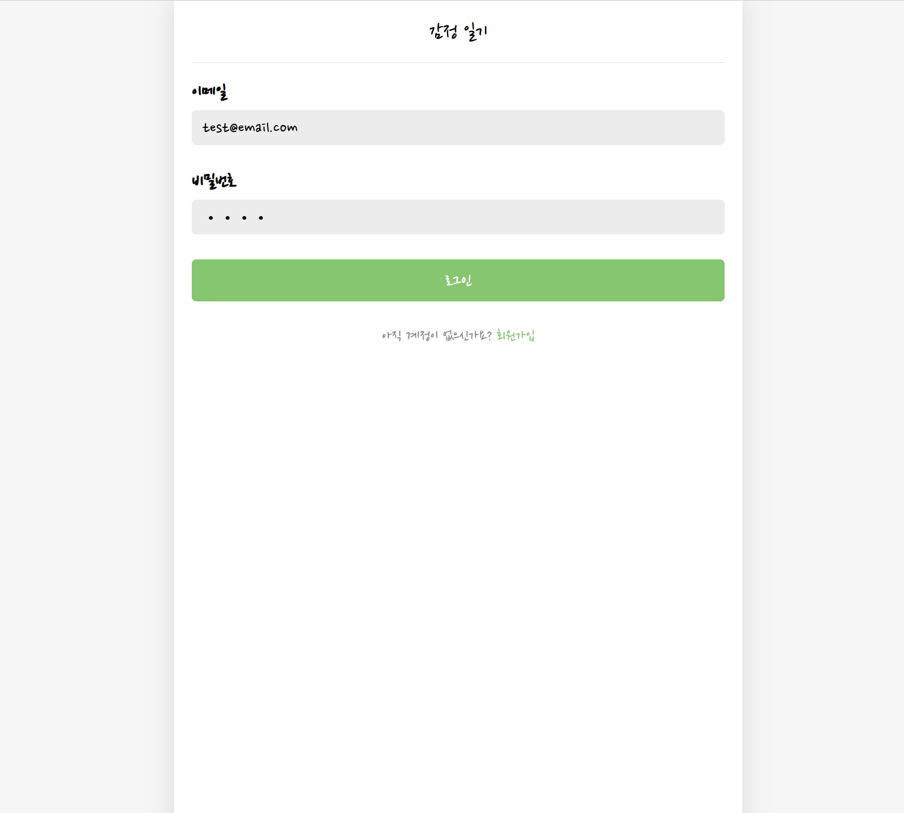
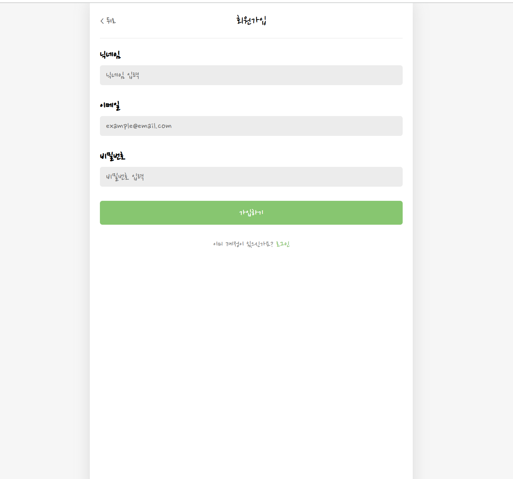
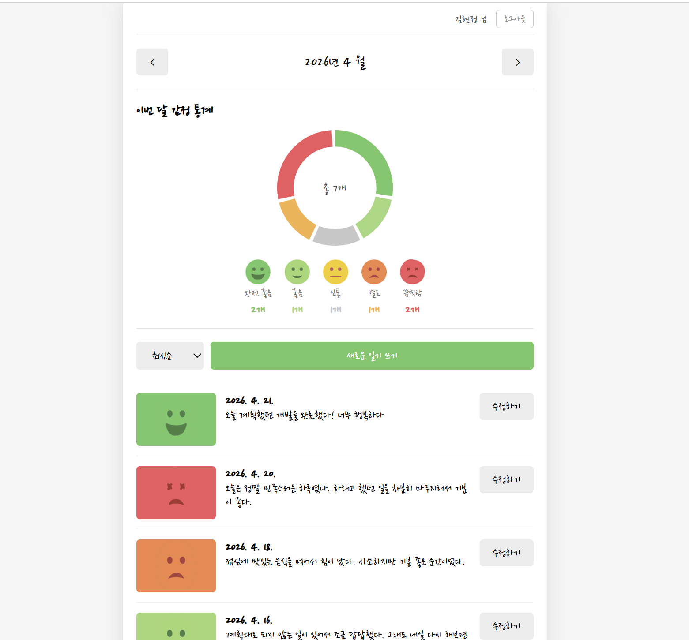
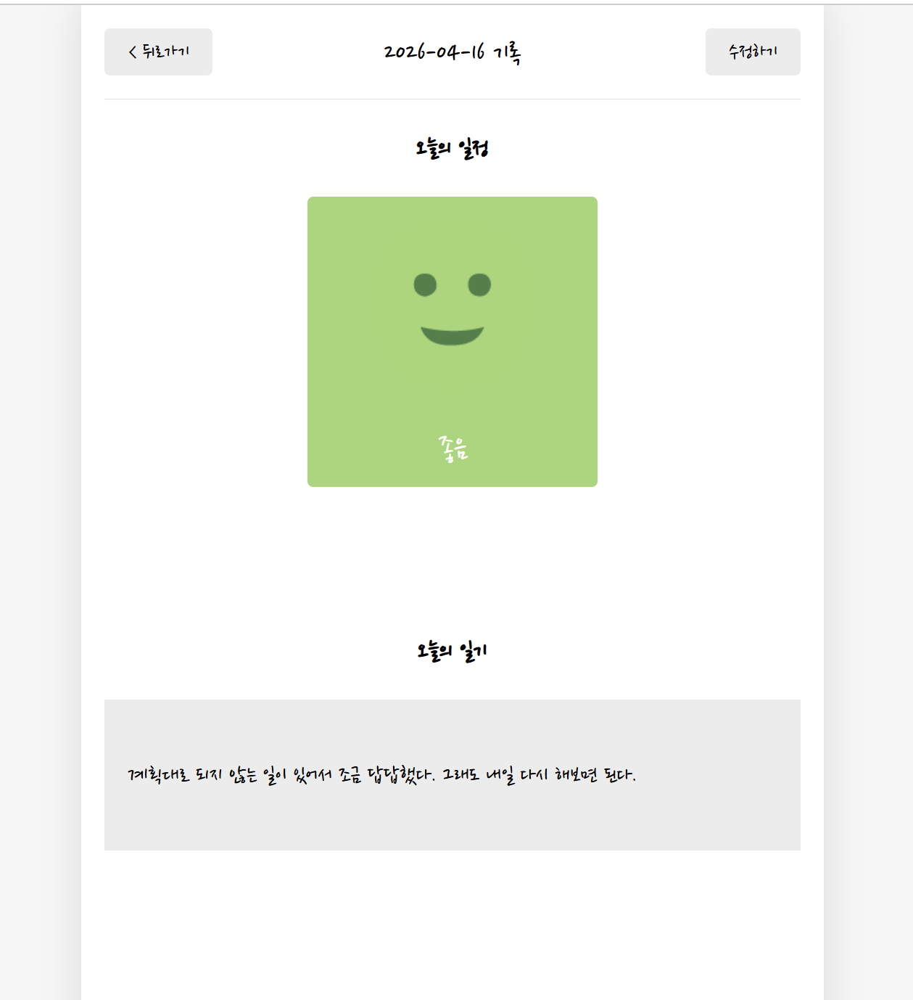
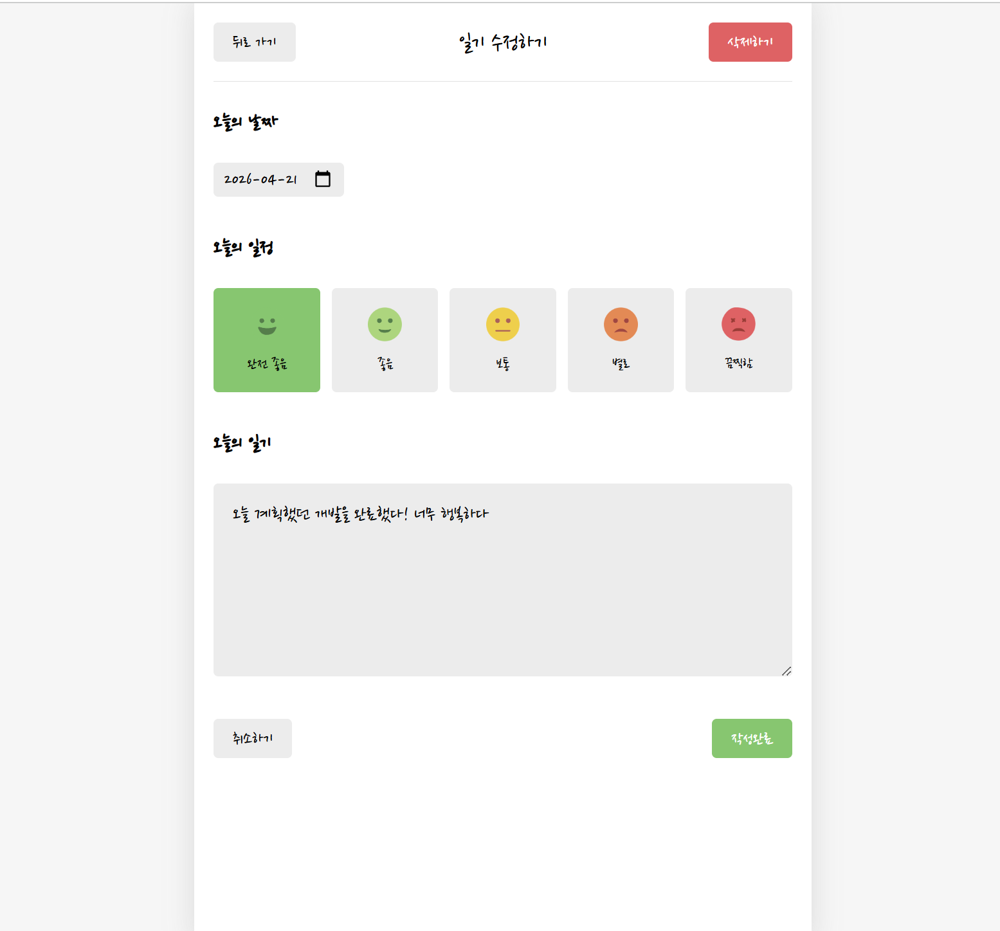

# 감정 일기

하루의 감정을 기록하고, 월별 감정 흐름을 시각화하는 다이어리 웹 애플리케이션입니다.  
React + Spring Boot 기반의 풀스택 프로젝트로, 백엔드와의 REST API 연동 및 JWT 인증을 직접 구현했습니다.

> **Backend Repository**: <!-- 백엔드 레포 링크 -->

---

## 화면

| 로그인 | 회원가입 |
|--------|----------|
|  |  |

| 홈 (월별 목록 + 감정 통계) | 일기 상세 |
|---------------------------|-----------|
|  |  |

| 작성 / 수정 |
|------------|
|  |

---

## 주요 기능

- **JWT 인증** — 로그인 · 회원가입 · 로그아웃, 토큰을 localStorage에 저장하여 요청마다 Authorization 헤더 전송
- **일기 CRUD** — 날짜 · 감정(5단계) · 내용 작성 / 수정 / 삭제
- **AI 응원 코멘트** — 일기 작성 후 서버가 반환한 응원 메시지를 모달로 표시
- **월별 감정 통계** — Recharts 도넛 차트로 해당 월의 감정 분포 시각화
- **페이징 + 정렬** — 최신순 / 오래된 순 정렬, 페이지 단위 목록 조회
- **인증 보호 라우팅** — 비로그인 접근 시 로그인 페이지로 리다이렉트

---

## 기술 스택

| 구분 | 사용 기술 |
|------|-----------|
| Framework | React 19, Vite |
| Routing | React Router v7 |
| 차트 | Recharts |
| 상태 관리 | useReducer + Context API |
| API 통신 | Fetch API (REST) |
| 인증 | JWT (Bearer Token) |

---

## 아키텍처

```
src/
├── api/          # fetch 함수 모음 (diaryApi.js, authApi.js)
├── components/   # 재사용 UI 컴포넌트
├── hooks/        # useDiary 커스텀 훅
├── pages/        # Home / New / Edit / Diary / Login / Register
└── utils/        # 날짜 포맷, 감정 이미지 매핑, 상수
```

**상태 흐름**

- `App.jsx`가 `useReducer`로 일기 목록 상태를 소유
- `DiaryStateContext` / `DiaryDispatchContext` / `UserContext` 세 가지 Context로 하위 컴포넌트에 공급
- CRUD 성공 시 `dataVersion`을 증가시켜 Home의 `useEffect`가 자동으로 목록을 재조회

---

## 로컬 실행

**1. 환경 변수 설정**

```bash
cp .env.example .env.local
# VITE_API_BASE_URL=http://localhost:8080
```

**2. 의존성 설치 및 실행**

```bash
npm install
npm run dev
```

백엔드 서버가 실행 중이어야 정상 동작합니다.

---

## API 연동 명세

| Method | Endpoint | 설명 |
|--------|----------|------|
| POST | `/api/auth/login` | 로그인 |
| POST | `/api/auth/register` | 회원가입 |
| GET | `/api/diaries` | 월별 일기 목록 (페이징) |
| POST | `/api/diaries` | 일기 생성 |
| GET | `/api/diaries/:id` | 일기 단건 조회 |
| PUT | `/api/diaries/:id` | 일기 수정 |
| DELETE | `/api/diaries/:id` | 일기 삭제 |
| GET | `/api/diaries/stats` | 월별 감정 통계 |
